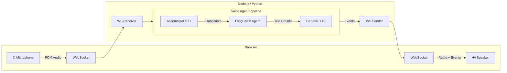

# Voice Sandwich Demo 🥪

A real-time, voice-to-voice AI pipeline demo featuring a sandwich shop order assistant. Built with LangChain/LangGraph agents, AssemblyAI for speech-to-text, and Cartesia for text-to-speech.

## Architecture

The pipeline processes audio through three transform stages using async generators with a producer-consumer pattern:



### Pipeline Stages

Each stage is an async generator that transforms a stream of events:

1. **STT Stage** (`sttStream`): Streams audio to AssemblyAI, yields transcription events (`stt_chunk`, `stt_output`)
2. **Agent Stage** (`agentStream`): Passes upstream events through, invokes LangChain agent on final transcripts, yields agent responses (`agent_chunk`, `tool_call`, `tool_result`, `agent_end`)
3. **TTS Stage** (`ttsStream`): Passes upstream events through, sends agent text to Cartesia, yields audio events (`tts_chunk`)

## Prerequisites

- **Node.js** (v18+) or **Python** (3.11+)
- **pnpm** or **uv** (Python package manager)

### API Keys

| Service | Environment Variable | Purpose |
|---------|---------------------|---------|
| AssemblyAI | `ASSEMBLYAI_API_KEY` | Speech-to-Text |
| Cartesia | `CARTESIA_API_KEY` | Text-to-Speech |
| OpenAI | `OPENAI_API_KEY` | Python backend agent |
| Anthropic | `ANTHROPIC_API_KEY` | TypeScript backend agent |

## Quick Start

### Using Make (Recommended)

```bash
# Install all dependencies
make bootstrap

# Run TypeScript implementation (with hot reload)
make dev-ts

# Or run Python implementation (with hot reload)
make dev-py
```

The app will be available at `http://localhost:8000`

### Windows PowerShell

On Windows, prefer the manual commands below instead of `make`.

- The `Makefile` uses Unix shell commands that do not work reliably in PowerShell.
- If your project path contains `&`, `npm run build` may fail. In that case, call Vite directly.

#### Python backend on Windows

```powershell
cd components/web
npm install --legacy-peer-deps
node .\node_modules\vite\bin\vite.js build

cd ..\python
uv sync --dev
uv run uvicorn main:app --app-dir src --host 127.0.0.1 --port 8001
```

Then open `http://127.0.0.1:8001`.

#### Kitchen display

Once the Python backend is running, the kitchen screen is available at:

```text
http://127.0.0.1:8001/kitchen
```

Keep that page open while you create or confirm orders from the main voice experience. New orders should appear automatically without refreshing the page, and the kitchen UI can move each order through `nuevo`, `en preparación`, and `listo`.

### Manual Setup

#### TypeScript

```bash
cd components/typescript
pnpm install
cd ../web
pnpm install && pnpm build
cd ../typescript
pnpm run server
```

#### Python

```bash
cd components/python
uv sync --dev
cd ../web
pnpm install && pnpm build
cd ../python
uv run src/main.py
```

The Python entrypoint reads `HOST`, `PORT`, and `RELOAD` from the environment. Example:

```powershell
$env:PORT="8001"
$env:RELOAD="true"
uv run src/main.py
```

## Real-Time Kitchen Module

This project now includes a lightweight Kitchen Display System at `/kitchen`.

### How it works

1. The voice agent adds items through `add_to_order`.
2. When the order is confirmed with `confirm_order`, the Python backend stores it in memory.
3. The backend broadcasts the new order to all `/kitchen/ws` subscribers over WebSocket.
4. The `/kitchen` UI updates automatically and can send status changes back to the backend in real time.

### How to test the flow

1. Open the main app at `http://127.0.0.1:8001/`.
2. Open the kitchen display at `http://127.0.0.1:8001/kitchen`.
3. Start a voice session and place an order.
4. Confirm the order so the agent calls `confirm_order`.
5. Verify the order appears immediately in `/kitchen`.
6. Change the order state from the kitchen UI and confirm the update stays visible.

### Technologies used for the kitchen module

- FastAPI WebSockets for kitchen event delivery
- In-memory order store on the Python backend
- Svelte client route for `/kitchen`
- Shared frontend build served by the existing app

## Project Structure

```
components/
├── web/                 # Svelte frontend (shared by both backends)
│   └── src/
├── typescript/          # Node.js backend
│   └── src/
│       ├── index.ts     # Main server & pipeline
│       ├── assemblyai/  # AssemblyAI STT client
│       ├── cartesia/    # Cartesia TTS client
│       └── elevenlabs/  # Alternate TTS client
└── python/              # Python backend
    └── src/
        ├── main.py             # Main server & pipeline
        ├── assemblyai_stt.py
        ├── cartesia_tts.py
        ├── elevenlabs_tts.py   # Alternate TTS client
        └── events.py           # Event type definitions
```

## Event Types

The pipeline communicates via a unified event stream:

| Event | Direction | Description |
|-------|-----------|-------------|
| `stt_chunk` | STT → Client | Partial transcription (real-time feedback) |
| `stt_output` | STT → Agent | Final transcription |
| `agent_chunk` | Agent → TTS | Text chunk from agent response |
| `tool_call` | Agent → Client | Tool invocation |
| `tool_result` | Agent → Client | Tool execution result |
| `agent_end` | Agent → TTS | Signals end of agent turn |
| `tts_chunk` | TTS → Client | Audio chunk for playback |
